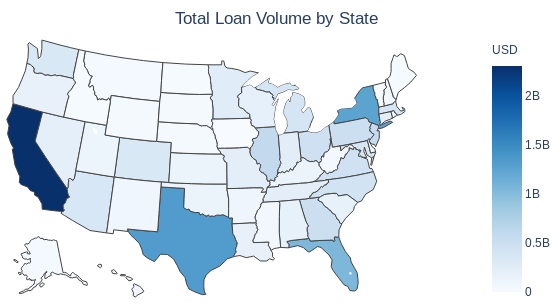

# LoanEvaluator
---

For a quick summary of the project, see these
[slides](slides.pdf).

### What is LoanEvaluator?
---

A 
[web app](http://www.loanevaluator.net) 
that predicts the probability 
that a given LendingClub loan will be charged-off.

### How to use LoanEvaluator?
---

If you are considering funding a LendingClub loan, fill in the
loan details in the fields provided on the landing page, and click
'Make Prediction'. You will be shown the probability that 
the loan will be charged-off.

### How does LoanEvaluator work?
---

Behind LoanEvaluator is a machine learning model trained on a dataset 
provided by LendingClub. When you submit the loan details, the information
is preprocessed using 
[jQuery](http://jquery.com)
and 
[PHP](http://www.php.net),
and then passed onto the machine learning model. The model then processes your
data and returns a prediction. The model is deployed on an 
[AWS](http://aws.amazon.com)
(Amazon Web Service) EC2 (Elastic Compute Cloud) t2.micro instance using the 
[Flask](http://palletsprojects.com/p/flask)
framework. 

### What is LendingClub?
---

A peer-to-peer lending 
[company](http://www.lendingclub.com) 
that directly matches borrowers and investors through an online platform. 
LendingClub is a listed public company, with a market capitalization of $373 
million, as of 18-September-2020. The market capitalization was in excess of 
$9 billion in 2014, the year in which the company went public. LendingClub 
[claims](http://www.lendingclub.com/info/statistics.action) 
to have issued loans totaling approximately $60 billion, as of June 2020.

Borrowers can create unsecured personal loans between $1,000 and $40,000.
LendingClub makes available a loan listing for investors to
pick and choose. The loan listing contains information supplied
by both the borrower (for example, annual income, home ownership) and 
LendingClub (for example, interest rate, subgrade). Investors make money 
from interest, while LendingClub makes money by charging borrowers 
certain fees. The company shares data about all loans issued through its 
website.

### How was the machine learning model built, and what is included in this repository?
---

The machine learning model was trained on a dataset downloaded from 
[kaggle/wordsforthewise](http://www.kaggle.com/wordsforthewise/lending-club).
The dataset consisted of all loans issued between the years 2007 and 2018. 
The raw dataset was of size 2.5 GB, and consisted of 2.2 million rows and 
151 features. 

The goal of the machine learning model is to classify 
a given loan instance as either 'Fully Paid' or 'Charged Off'.

The work was completed in the following three Jupyter Notebooks, all
included in this repository.

1. **Exploring and cleaning the data:**
The primary purpose of this notebook is to understand the LendingClub loan 
dataset, and to prepare it for exploratory data analysis. 
    - Features that are unavailable to the potential investor at the time of 
investment are identified and dropped. Features that have only 
one unique value and features that are missing more than 30% of the values 
are dropped.
    - Numerical and categorical features are identified and studied. 
    - Distribution of each feature is studied using histograms and 
count plots.
    - A test set is put aside.

2. **Examining the relationships between features and the target:**
The primary purpose of this notebook is to identify steps that may improve 
performance of machine learning models.
    - The potential usefulness of each numerical feature is determined 
by calculating charge-off rates for binned data, and by considering the Pearson 
and the Spearman correlation coefficients.
    - The charge-off rate for each category of categorical features
is determined. The gathered data helped determine the appropriate encoding 
(ordinal or one-hot) for the features.
    - New features are engineered, and it is found that they perform
better than some existing features.
    - The most important features are determined and ranked: *sub grade*, 
*interest rate*, *term*, *borrower's FICO score*, and 
*borrower's debt payment-to-income ratio*.

3. **Training machine learning models:**
The primary purpose of this notebook is to select a machine learning model. 
    - The dataset is imbalanced: approximately 80% of the data belongs 
to the negative class ('Fully Paid'), and 20% belongs to the positive class 
('Charged Off'). 
    - Two metrics are used for evaluation:
Precision-Recall Area Under the Curve and Receiver Operating 
Characteristic Area Under the Curve. 
    - A pipeline is created to perform the tasks of imputation, scaling,
encoding categorical features, and feature engineering.
    - Four models are considered: Logistic Regression, Random Forest, 
Linear Discriminant Analysis, and K-Nearest Neighbors. 
    - Overfitting is estimated by evaluating the four models on the training 
dataset, with and without cross-validation. 
    - Models are ranked by cross-validation score. Top models are selected, and 
their hyperparameter are tuned using a grid search. 
    - The Logistic Regression model with L2 regularization is selected 
as the final model, and evaluated on the test set, achieving an ROC AUC score 
of 0.71.
    - The Logistic Regression model has the added advantage that it is 
naturally well-calibrated in terms of output probabilities.
    - This notebook was run on an AWS EC2 c5.9xlarge instance.

**Main tools and packages used for the project:** 
[Jupyter Notebook](http://jupyter.org), 
[NumPy](http://numpy.org), 
[pandas](http://pandas.pydata.org), 
[Matplotlib](http://matplotlib.org), 
[seaborn](http://seaborn.pydata.org), 
[SciPy](http://www.scipy.org),
[scikit-learn](http://scikit-learn.org),
[Flask](http://palletsprojects.com/p/flask),
[jQuery](http://jquery.com), 
and 
[PHP](http://www.php.net).
